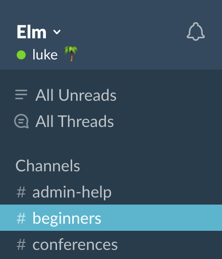
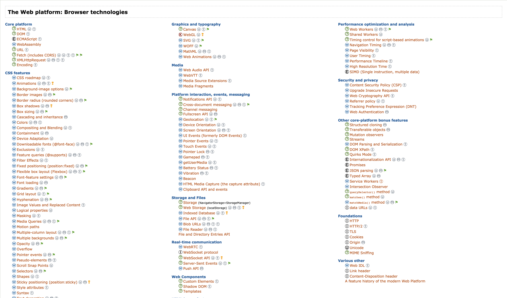
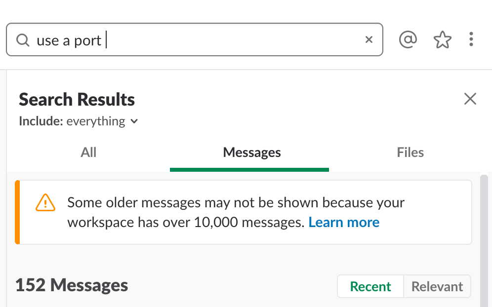
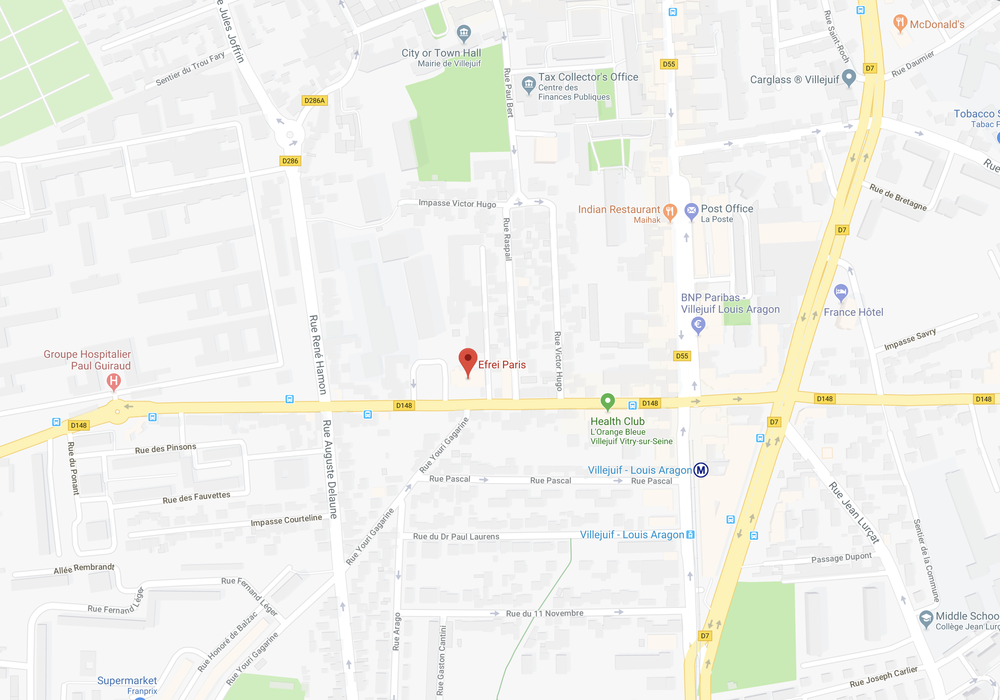
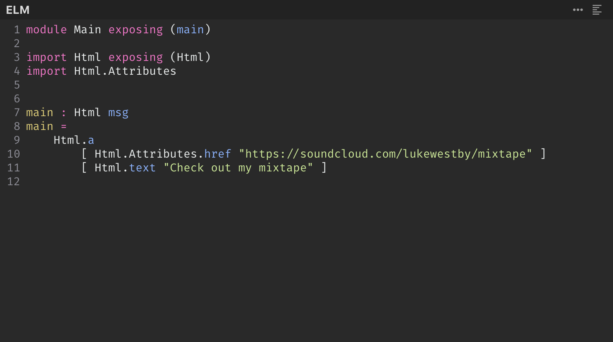
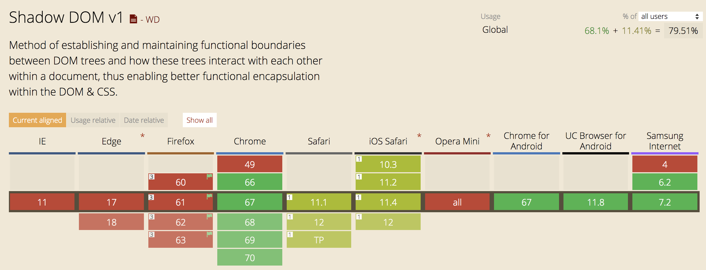
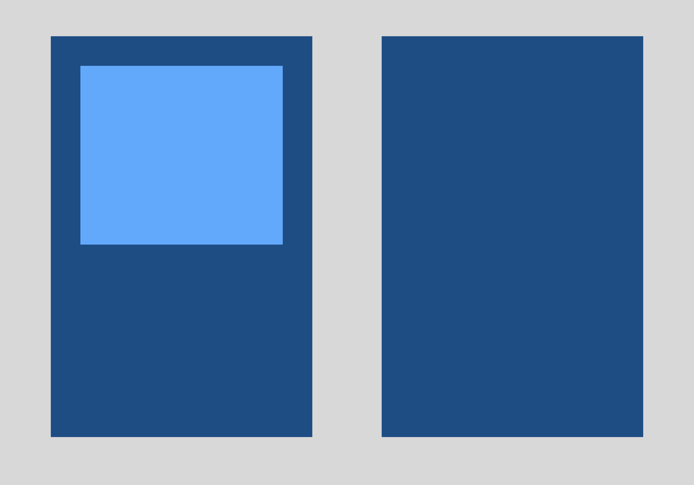
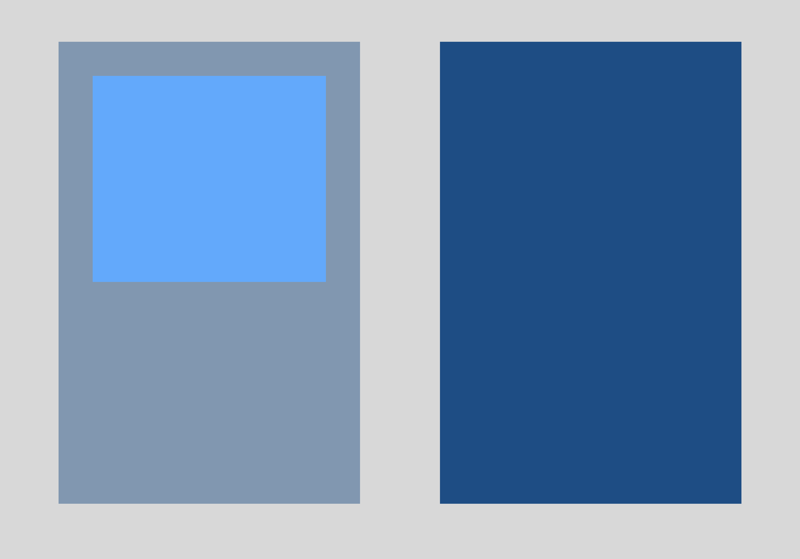
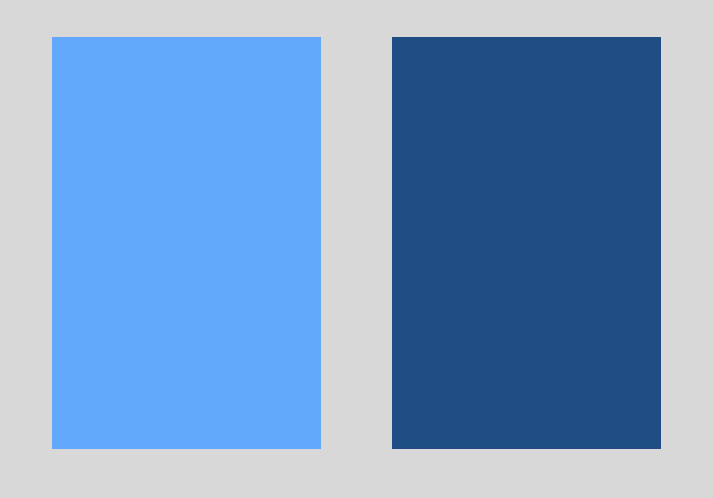

# [fit] Hello!

---

# [fit] I'm Luke

---


---


---


---



---


---



---



---


---


---



---



---

# [fit] `port module Main`

---

```elm
Html.div
    [ Html.Attributes.id "text_editor" ]
    []
```

---

```elm
port textEditorOut : (String, Value) -> Cmd msg

port textEditorIn : ((String, Value) -> msg) -> Sub msg
```

---

```elm
init : (Model, Cmd Msg)
init =
    ( initialModel
    , textEditorOut ("Init", Encode.null)
    )
```

---

```javascript
app.ports.textEditorOut.subscribe(([type, data]) => {
    requestAnimationFrame(() => {
        switch (type) {
            case 'Init':
                const element = document.getElementById('text_editor')
                if (!element) return // ????????
                const editor = CodeMirror(element, {
                    lineNumbers: true,
                    mode: 'elm',
                    value: ''
                })
                element._editor = editor
                return
        }
    })
})
```
---

```javascript
const editor = CodeMirror(element, {
    lineNumbers: true,
    mode: 'elm',
    value: ''
})

editor.on('changes', () => {
    app.ports.textEditorIn.send(['ValueUpdated', editor.getValue()])
})
```

---

```elm
type Msg
    = CodeChanged String
    | NoOp
```

---

```elm
CodeChanged code ->
    { model | code = code }
```

---

```elm
subscriptions model =
    textEditorIn <|
        \(type_, data) ->
            case type_ of
                "ValueUpdated" ->
                    data
                        |> Decode.decodeValue Decode.string
                        |> Result.map ValueUpdated
                        |> Result.withDefault NoOp -- ?????

                _ ->
                    NoOp -- ???????
```

---

```elm
type Msg
    = CodeChanged String
    | ResetCode
    | NoOp
```

---

```elm
ResetCode ->
    ( { model | code = "" }
    , textEditorOut ("ValueUpdated", Encode.string "")
    )
```
---

```javascript
app.ports.textEditorOut.subscribe(([type, data]) => {
    requestAnimationFrame(() => {
        switch (type) {
            case 'Init':
                // ...
            case 'ValueUpdated':
                const element = document.getElementById('text_editor')
                if (!element) return
                const editor = element._editor
                if (!editor) return // ?????
                editor.setValue(data)
                return
        }
    })
})
```
---

# [fit] DONE

---


---

```elm
Html.textarea
    [ Html.Attributes.value model.code
    , Html.Events.onInput CodeChanged
    ]
    []
```

---

```elm
Html.codeEditor
    [ Html.Attributes.editorValue model.value
    , Html.Events.onEditorChanged CodeChanged
    ]
    []
```

---

# [fit] Folks

---

# [fit] Turns out

---

# [fit] You can do this

---

# [fit] You can do this
# with just today's Elm
# and the Web Platform

---

# [fit] RIGHT NOW

---


---

```elm
Html.codeEditor
    [ Html.Attributes.editorValue model.value
    , Html.Events.onEditorChanged CodeChanged
    ]
    []
```

---

```elm
Html.node "code-editor"
    [ Html.Attributes.property "editorValue" <|
        Encode.string model.value
    , Html.Events.on "editorChanged"
        <| Json.Decode.map CodeChanged
        <| Json.Decode.at ["target", "editorValue"]
        <| Json.Decode.string
    ]
    []
```

---

# [fit] "Hell yeah, dude"
### [fit] – Me, to myself after figuring out how to do this

---

# [fit] ⚠️ Some warnings ⚠️

---

## Warning #1
# The Elm Virtual DOM is always right

---

```elm
Maps.map
    [ Maps.marker { lat = 0, lng = 0 }
    , Maps.marker { lat = 180, lng = 180 }
    ]
```

---

```html
<maps-map>
  <maps-marker />
  <maps-marker />
</maps-map>
```

vs.

```html
<maps-map>
  <canvas ... />
</maps-map>
```

---

# [fit] Shadow DOM

---



---

```elm
module Maps exposing (..)

import Html exposing (Html)
import Html.Attributes
 

map : List Marker -> Html msg
map markers =
    Html.node "maps-map"
        [ Html.Attributes.property "markers" (encodeMarkers markers) ]
        []
```

---

## Warning #2
# The Elm Virtual DOM reuses nodes

---



---



---



---


---

## Warning #3
# Don't use `value`

---

##### Warning #3
#### Don't use `value`

---

## Warning #3
# Don't use `value`

---

# Recommendations:

## 1. Always use leaf nodes
## 2. Don't use `value`

---

```elm
view : List (Attribute msg) -> Html msg
view attributes =
    Html.node "code-editor" attributes []
```

#### https://github.com/ellie-app/ellie/blob/master/assets/src/Ellie/Ui/CodeEditor.elm#L112-L114

---

```elm
Html.styled (Html.node "nri-textarea-v3")
    [ Css.display Css.block ]
    autoresizeAttrs
    [ Html.styled Html.textarea
        [ {- ... -} ]
        [ {- ... -} ]
        [ Html.text model.value ]
    ]
```

---


---

# [fit] UI widget?
# [fit] Custom Element!

---

# [fit] Growth Hacking AI Blockchain client, etc?
# [fit] Use a port

---


---

# [fit] lukewestby1@gmail.com


- https://developer.mozilla.org/en-US/docs/Web/Web\_Components/Using\_custom\_elements
- https://github.com/webcomponents/custom-elements
